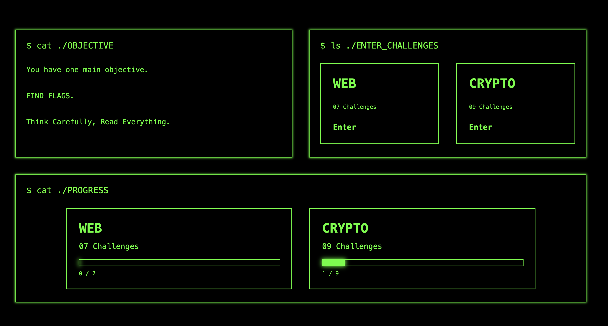
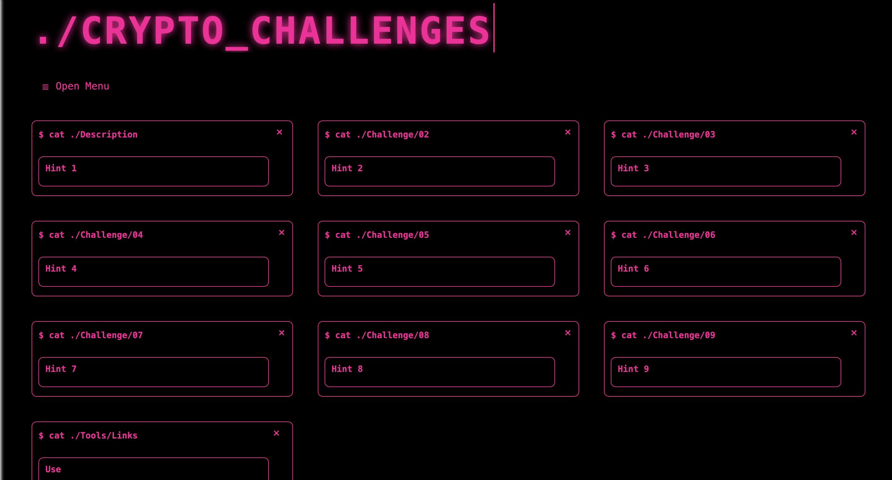

# CTF_Challenges

The idea of this page was to create a selection of easy to hard challenges that cover a range of different cryptography ciphers as well as web exploration challenges. Creating a CTF style challenge website to learn, 
problem solve, and explore cybersecurity areas. 

## Demo Link
https://elliewoodward2024-ops.github.io/CTF_Challenges/ 

## Images




## Features

 - 2 Pages of Challenges
    -    Cryptography, 9 Challenges
    -    Web Exploration, 7 Challenges
 - Solution Page
 - Answer Check with Progress Bar
 
## Installation to run locally

1. You will need to Clone the repository: 
   ```
   git clone https://github.com/elliewoodward2024-ops/CTF_Challenges.git
2. Open the project in your code editor such as VS Code.
3. Open `index.html` in your browser. 


#### AI USAGE
Only AI usage was to fix some errors that I couldn't seem to identify. Helped mainly fix 
problems with my JS due to my lacking experience in the language. No other usage otherwise. 
